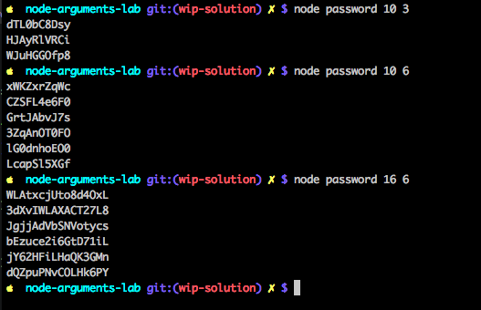

# Node Arguments Lab


## Objectives

1. Implement a CLI app which generates random passwords
1. Use two CLI arguments as the input of the app: one for length of the password and another for the number of randomly generated passwords.

## Introduction

You've been hired to enhance security at a major US bank amidst the breach in their database. As a security expert you know to that offering users randomly generated passwords will make it hardly for pesky hackers to brute force the attack. This app must use command-line interface and be flexible to be used for passwords of different length and for various number of passwords.

In this lab, you will pass and access command-line arguments to implement a CLI app which generates random passwords.

Knowing how to pass and access command-line arguments is important in building CLI tools or small programs like the program which gives a random number.



## Instructions

1. Implement a Node script `password.js` which takes 2 CLI arguments and prints random passwords based on the arguments.
1. Use two arguments: length (first) and a number of passwords (second) to print, so that `node password 2 2` and `node password 10 3` are valid commands. The former will print 2 passwords with the length of 2 and the latter 3 passwords with the length of 10.
2. Optional: implement `generatePassword()` function in the `password.js` to get random passwords. Name of the function doesn't matter. You don't even have to have a separate function, you can just implement the code in the file without a function. If it's too hard, look up our implementation online (Stackoverflow!). The password generation is not focus of this lab, so we won't test your passwords on strength or randomness. Just do you best not to hard code them. ;)
3. Optional: Output error messages when the type of CLI arguments is wrong or when there's only 1 argument instead of 2.
3. Finish program with `process.exit(0)`
1. Run `$ npm test` to test


### Extra Info

In the tests, you'll see `child_process`. It's a super easy and cool core module which allows you to start any other programs/processes from within your Node app. All you do is pass parameters to `spawn()`:

```js
process = childProcess.spawn(command, [scriptName, cliArgument1, cliArgument2])
```

Node's `child_process.spawn` is similar to how you run [multiple processes with Ruby with `Process.spawn`](https://en.wikibooks.org/wiki/Ruby_Programming/Running_Multiple_Processes).

In this lab, we are using `child_process.spawn` to start your `password.js` script with arguments 140 and 1. Snippet goes like this:

```js
passwordAppProcess = cp.spawn('node', ['password', '140', '1'])
passwordAppProcess.stdout.on('data', (data) => {
  // data is the output of the password.js  script
  passwordAppProcess.kill() 
})
```

`kill()` is the command to terminate the child process (your `password.js` program).

* [JavaScript password generator on Stackoverflow](http://stackoverflow.com/questions/1497481/javascript-password-generator)
